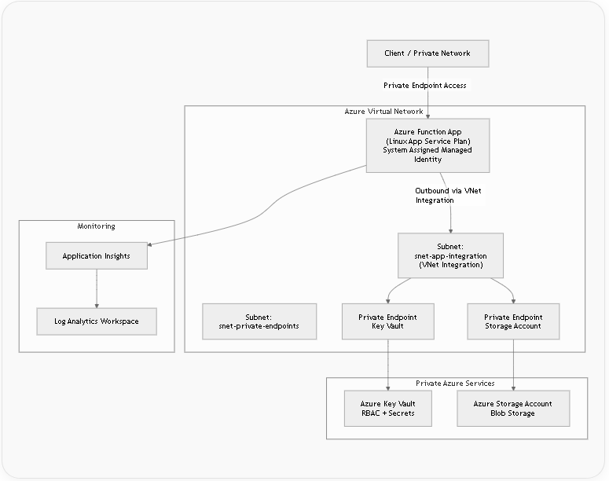

# Azure Zero Trust Serverless API with Terraform

A portfolio project demonstrating a **Zero Trust Azure Function API architecture** built with **Terraform** using a **multi-stack design**. The environment is structured to show secure cloud patterns including **private endpoints, private DNS, managed identity, Key Vault RBAC, VNet integration, and centralized observability**.

> Note: The current workload runs on a **dedicated Linux App Service plan (B1)** for cost-controlled development. While the app uses Azure Functions, this is not a true Consumption/Flex Consumption deployment.

---

## Project Goals

This project was built to demonstrate practical skills in:

- **Terraform multi-stack architecture**
- **Azure networking and private connectivity**
- **Zero Trust design principles**
- **Managed identities and RBAC**
- **Private endpoints + private DNS**
- **Infrastructure observability**
- **Cloud portfolio readiness for DevOps / Cloud / Platform roles**

---

## Architecture Overview

The solution is split into layered Terraform stacks so each concern is isolated and reusable:

infra/
 ├── stacks/
 │   ├── 00-bootstrap        # remote Terraform state backend
 │   ├── 10-core             # network + logging + private DNS
 │   ├── 20-private-services # key vault + storage + private endpoints
 │   └── 30-workload         # function app / identity / VNet integration / private endpoint

---

## High Level Flow

Client / Private Network
        |
        v
 Azure Function App
 (private endpoint for inbound)
        |
        v
 VNet Integration Subnet
 (outbound private access)
        |
        +-----------------------> Azure Key Vault (private endpoint)
        |
        +-----------------------> Azure Storage Account (private endpoint)
        |
        v
 Log Analytics + Application Insights

